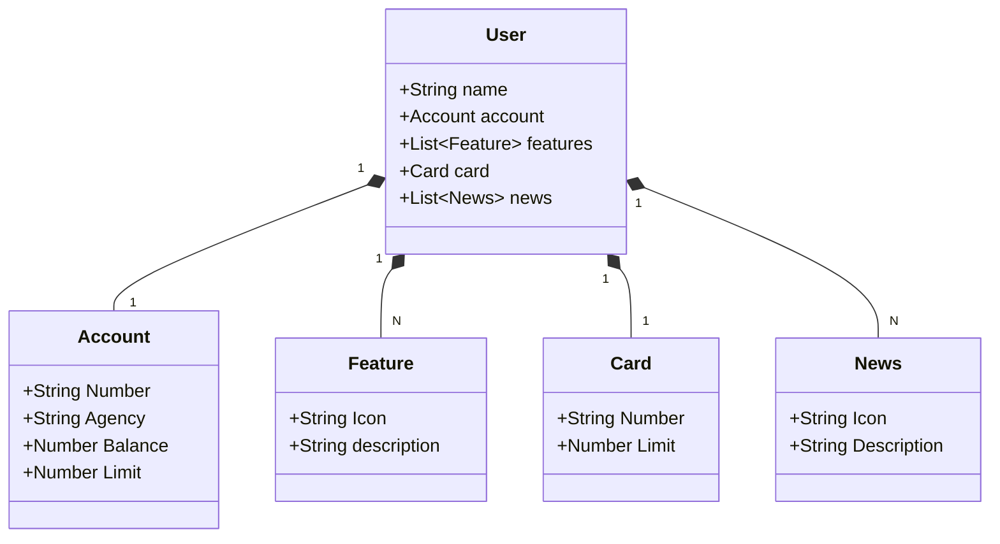

# API RESTful com Java 22, Spring Boot 3 e Railway

Este projeto de API RESTful construído com Java 22 pela plataforma de ensino da DIO. Este repositório exemplifica o uso das tecnologias mais recentes para criar uma API robusta, escalável e fácil de manter.

# Diagrama De Classes

# Tecnologias Utilizadas
* Java 22: A versão LTS mais recente, com novos recursos e melhorias.

* Spring Boot 3: Framework que facilita a configuração e inicialização de aplicações.

* Spring Data JPA: Simplifica a interação com bancos de dados relacionais.

* OpenAPI (Swagger): Ferramenta para documentação de APIs RESTful.

* Railway: Plataforma de deploy simplificada na nuvem.
